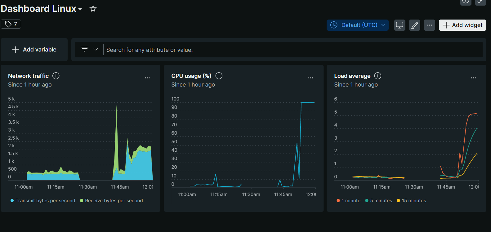

# Labo 02 - SaaS

## Lab's targets

The purpose of this lab is to allow us to experiment with a SaaS-type monitoring product.

* [ ] Discover the possible options of NewRelic (as well as the prices)

* [x] Deploy an agent.

* [x] 

* [x] Stress the vm and see the result on the NewRelic's Dashboard.

  

* [x] Receive an alert from New Relic in case of CPU overload.

